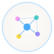
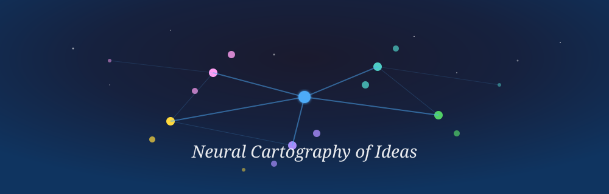
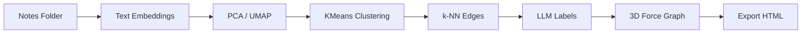

<div align="center">



# 🌌 Notagraph


**Neural Cartography of Ideas — visualize your notes as a 3D knowledge graph with AI embeddings and LLM annotations.**

[Live Demo](https://https://notagraph-n8kmqmlnp-kirin-jindoshs-projects.vercel.app) - [Quick Start](#-quick-start) - [Features](#-features) - [Architecture](#-architecture) - [Roadmap](#-roadmap)



</div>

> Notagraph does **not** upload your notes anywhere. All processing happens in your browser — embeddings, clustering, graph layout, everything.

> [!NOTE]
> Public examples are intentionally generic. Load your own `.md` or `.txt` folder to explore your personal knowledge constellation.

---

## 💡 Concept

Most note-taking apps trap your ideas in folders.

**Notagraph** builds a 3D gravitational field from your notes and lets you explore them as constellations, continents, and neural networks. Every word you wrote becomes a node. Every semantic connection becomes an edge. The AI names clusters, labels relationships, and finds the center of each idea cluster.

That makes it useful for:
- researchers mapping domains of knowledge
- writers tracking idea networks across drafts
- thinkers who want to *see* how concepts connect
- anyone who says **"show me my notes as a galaxy"**

---

## ✨ Features

| Feature | What it does |
|---------|-------------|
| **7 AI Providers** | Azure OpenAI, Gemini, OpenAI, OpenRouter, Mistral, Groq, local Ollama with smart field visibility |
| **4 Topologies** | Core, Clusters, Neural (UMAP), and Planet (clusters as continents on a sphere with surface arcs) |
| **3D Graph** | Force-directed with CSS2D labels, bloom post-processing, particle FX |
| **LLM Annotations** | Cluster naming, edge labeling, center nomination by AI |
| **Dim Reduction** | PCA + UMAP + k-NN for layout |
| **Parallel Labeling** | 150 edge pairs per round, 3x concurrency |
| **Rate Limit Retry** | Exponential backoff for Azure 429/503 |
| **Session Cache** | IndexedDB persistence + resume previous |
| **Export Snapshot** | Standalone HTML with embedded graph data |
| **Share Graph** | Copy link with resume parameter |
| **Privacy First** | All local. No tracking, no telemetry, no cookies |

---

## 🚀 Quick Start

1. Open [https://notagraph-n8kmqmlnp-kirin-jindoshs-projects.vercel.app](https://https://notagraph-n8kmqmlnp-kirin-jindoshs-projects.vercel.app)
2. Choose an AI provider and enter API key
3. Click **SELECT NOTES FOLDER** and choose your `.md` / `.txt` files
4. Wait for the pipeline (embeddings -> clustering -> LLM annotations)
5. Explore your knowledge graph in 4 topology modes

Done. No build, no install, no tracking.

---

## 🏗️ Architecture



## 📁 Structure

```
notagraph/
├── 📖 README.md              ← you are here
├── 📜 CHANGELOG.md           ← history of changes
│
├── 🌐 app.html               ← single-file application
│   ├── 7 AI providers        ← Azure, Gemini, OpenAI, OR, Mistral, Groq, Ollama
│   ├── 4 topology modes      ← Core, Clusters, Neural, Planet
│   ├── VFX panel             ← bloom, particles, node size, link opacity
│   └── Export snapshot       ← standalone HTML with embedded graph data
│
├── 🎨 assets/
│   ├── logo-mark.svg         ← cosmic node cluster mark
│   └── hero-banner.svg       ← 3D knowledge constellation banner
│
├── 🔧 index.html             ← sync of app.html for Vercel root
├── 🔑 api/                   ← optional FastAPI RAG backend
│   ├── main.py               ← chat endpoint
│   └── requirements.txt      ← dependencies
│
└── 📦 .github/               ← topics set via GitHub API
```

---

## 🗺️ Topologies

| Mode | Layout |
|------|--------|
| **CORE** | Medoid at center, notes radiate outward by distance |
| **CLUSTERS** | Thematic hubs with orbital notes around each center |
| **NEURAL** | UMAP projection, semantic proximity in vector space |
| **PLANET** | Clusters as continents on a sphere with surface arcs |

---

## 🏭 Providers

| Provider | Chat | Embeddings | Status |
|----------|------|-----------|--------|
| Azure OpenAI | GPT | text-embedding | ✅ Active |
| Gemini | Flash | embedding-001 | ✅ Active |
| OpenAI | GPT-4o-mini | text-embedding | ✅ Active |
| OpenRouter | Various | text-embedding | ✅ Active |
| Mistral | Small-latest | mistral-embed | ✅ Active |
| Groq | Llama-70B | Via Ollama fallback | ✅ Active |
| Ollama | Local models | nomic-embed-text | ✅ Local only |

---

## 📊 Status

| Feature | State |
|---------|-------|
| Multi-provider AI | ✅ Done |
| 3D force graph with bloom | ✅ Done |
| 4 topology modes | ✅ Done |
| LLM cluster naming | ✅ Done |
| LLM edge labeling | ✅ Done |
| Planet surface arcs | ✅ Done |
| Parallel labeling (150/round) | ✅ Done |
| Rate limit retry | ✅ Done |
| IndexedDB cache | ✅ Done |
| Export HTML snapshot | ✅ Done |
| Share link | ✅ Done |
| Search/filter | 🟡 Next |
| WebVR | 🟡 Next |
| Multi-folder colors | 🟡 Next |

---

## 🧰 Tech Stack

| Layer | Technology |
|-------|-----------|
| 3D Engine | Three.js + 3d-force-graph + CSS2DRenderer |
| Dim Reduction | UMAP.js + power iteration PCA |
| Clustering | KMeans++ |
| Layout | Force-directed 3D + k-NN |
| Bloom | Three.js postprocessing |
| Cache | IndexedDB |
| Deploy | Vercel (single static HTML file) |

---

## 🌐 Browser Support

| Browser | Support |
|---------|---------|
| Chrome / Edge | Full (File System Access API) |
| Firefox | webkitdirectory fallback |
| Safari | webkitdirectory fallback |

---

## 📄 License

MIT

---

<div align="center">

**Built by [Azamat Safarov](https://github.com/AzamatSafarov)**

[](https://github.com/AzamatSafarov)
[](https://t.me/kelebrimbor)

</div>
