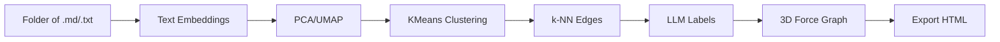

# Obsidian Universe

**Neural Cartography of Ideas - visualize your notes as a 3D knowledge graph with AI embeddings and LLM annotations.**

[Live Demo](https://topologies-of-ideas-universal.vercel.app) - [Quick Start](#quick-start) - [Features](#features) - [Architecture](#architecture) - [Roadmap](#roadmap)

---

> **Obsidian Universe** loads your `.md` and `.txt` notes and turns them into an explorable 3D knowledge constellation. All processing happens in your browser - nothing leaves your machine.

## Quick Start

1. Open [topologies-of-ideas-universal.vercel.app](https://topologies-of-ideas-universal.vercel.app)
2. Choose an AI provider (Azure, Gemini, OpenAI, OpenRouter, Mistral, Groq, or local Ollama)
3. Paste your API key and enter model names
4. Click **SELECT NOTES FOLDER** and choose your note folder
5. Wait for the pipeline (embeddings, clustering, LLM annotations)
6. Explore your knowledge graph in 4 topology modes

Done. No build, no install, no tracking.

## Features

| Feature | What it does |
|---------|-------------|
| **7 AI Providers** | Azure OpenAI, Gemini, OpenAI, OpenRouter, Mistral, Groq, local Ollama with smart field visibility |
| **4 Topologies** | Core, Clusters, Neural (UMAP), and Planet (clusters as continents on a sphere) |
| **3D Graph** | Force-directed with CSS2D labels, bloom post-processing, particle FX |
| **LLM Annotations** | Cluster naming, edge labeling, center nomination by AI |
| **Dim Reduction** | PCA + UMAP + k-NN for layout |
| **Parallel Labeling** | 150 edge pairs per round, 3x concurrency |
| **Rate Limit Retry** | Exponential backoff for Azure 429/503 |
| **Session Cache** | IndexedDB persistence + resume previous |
| **Export Snapshot** | Standalone HTML with embedded graph data |
| **Share Graph** | Copy link with resume parameter |
| **Privacy First** | All local. No tracking, no telemetry, no cookies |

## Architecture

## Topologies

| Mode | Layout |
|------|--------|
| **CORE** | Medoid at center, notes radiate outward by distance |
| **CLUSTERS** | Thematic hubs with orbital notes around each center |
| **NEURAL** | UMAP projection, semantic proximity in vector space |
| **PLANET** | Clusters as continents on a sphere with surface arcs |

## Browser Support

| Browser | Support |
|---------|---------|
| Chrome / Edge | Full (File System Access API) |
| Firefox | webkitdirectory fallback |
| Safari | webkitdirectory fallback |

## Tech Stack

| Layer | Technology |
|-------|-----------|
| 3D Engine | Three.js + 3d-force-graph + CSS2DRenderer |
| Dim Reduction | UMAP.js + power iteration PCA |
| Clustering | KMeans++ |
| Layout | Force-directed 3D + k-NN |
| Cache | IndexedDB |
| Deploy | Vercel (single static HTML file) |

## Roadmap

- [x] Multi-provider AI support (7 providers)
- [x] Planet topology with surface arcs
- [x] Parallel edge labeling
- [x] Export standalone HTML
- [ ] Search/filter notes in graph
- [ ] WebVR mode
- [ ] Multi-folder support with color coding

## License

MIT

---

**Built by [Azamat Safarov](https://github.com/AzamatSafarov)**

[Telegram](https://t.me/kelebrimbor) - [GitHub](https://github.com/AzamatSafarov)

